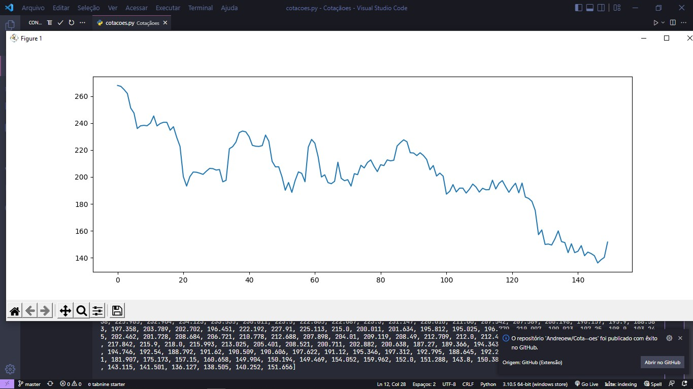

## Criando grafico com python

  * neste caso criei um gráfico do Bitcoin do período Jan/2022 a Mai/2022.
  + Python
    + pip install:
      * requests
      * json
      * matplotlib 

  * Api utilizada: https://docs.awesomeapi.com.br/

    + https://economia.awesomeapi.com.br/json/daily/BTC-BRL/200?start_date=20220101&end_date=20220530'
      - BTC-BRL = Moeda
      - /200 = quantidade de cotações
      - ?start_data = 01/01/2022
      -&end_date = 30/05/2022                                                         

  Resultado:
  

  + <h1>Autor: André de Souza</h1>